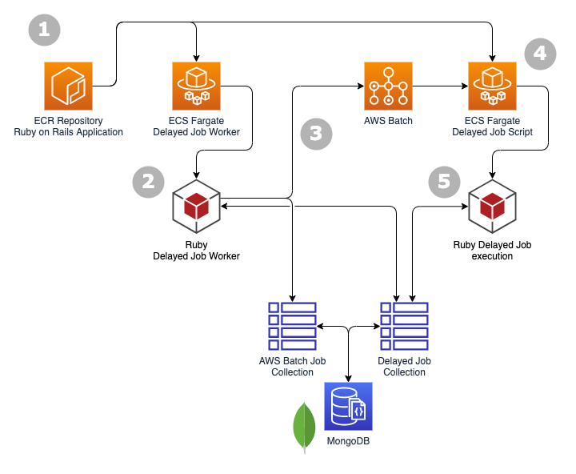

# Delayed Job on AWS Batch

## Sample Mongoid & Rails API Application

This repository contains a sample Ruby on Rails API application using Mongoid.

It has been developed following the
[Mongoid getting started guide with Rails](https://docs.mongodb.com/mongoid/master/tutorials/getting-started-rails/).

Sourced from https://github.com/mongoid/mongoid-demo

## Dejayed Job in AWS Batch

This repository has had Delayed Job added for the purposes of a proof-of-concept around offloading execution of the Delayed Job itself to AWS Batch. The general idea is that instead of the Delayed Job worker both selecting and executing the job, the worker just selects a job and submits the execution to AWS Batch. The worker synchronously waits for the execution to complete and then continues.

The motivation of this proof-of-concept are:

- decouple the compute environment for the job from the worker itself
  - this protects non-idempotent, non-interruptible jobs without needing to protect the worker process itself
  - the worker process can be restarted, redeployed, etc. because it has an idempotent wrapper around the job _actually_ running in AWS Batch
- control over the compute environment for the job -- jobs could be extended to specify memory and compute requirements as needed
- avoid code changes to an existing Delayed Job code base in regards to the job code itself or the calling code that schedules the jobs



1. Rails application is packaged and pushed to an ECR Repository. This image will be used for the other Fargate-based components of the solution.

2. Fargate service runs a Delayed Job worker but with the AWS Batch plugin applied:
   ```
   # task uses the following as command

   bin/delayed_job_aws_batch
   ```
   This Delayed Job worker picks up Delayed Job jobs from the collection in MongoDB as per normal, but the worker behaviour for the job is overriden as per (3) below.

3. The Delayed Job worker, instead of performing job as normal, submits a job to AWS Batch with the Job ID. It then simply polls the status of the AWS Batch job until it completes.

   It also inserts a marker item into a collection in MongoDB that simply correlates the Delayed Job ID and the AWS Batch Job ID. This is used to protect against duplicating a running job on AWS Batch if the Delayed Job worker restarts and picks up the same job.

4. AWS Batch executes the job via Fargate, using the same container image. This job executes with a different command that executes Delayed Job against the provided Job ID:
   ```
   bin/run_delayed_job <JobID>
   ```
5. Delayed Job execution handles running job as per normal. Being within the Delayed Job execution context, success and failure are appropriately handled: i.e. successful jobs are deleted, failed jobs are rescheduled as per `max_attempts` configuration, etc.

### Important Files

Most of this repository is example code generated simply to have a running Rails + MongoDB application to work with. This table lists the important files. I don't write Ruby, don't shoot me for the mess.

| File                | Description |
| ------------------- | ----------- |
| [dummy_job.rb](./app/jobs/dummy_job.rb) | Provides a simple job that can be scheduled that echoes the provided string |
| [dummy_error_job.rb](./app/jobs/dummy_job.rb) | Provides a simple job that can be scheduled that raises an exception, for the purposes of testing failure behaviour |
| [aws_batch_job.rb](./lib/aws_batch_job.rb) | Class for storing transient state in MongoDB to map Delayed Job ID to AWS Batch Job ID. This allows for idempotency in the worker for in-flight jobs if the worker restarts |
| [aws_batch_execution_plugin.rb](./lib/aws_batch_execution_plugin.rb) | Delayed Job Plugin that wraps the `:perform:` lifecycle event of the worker. See [more information](#aws-batch-execution-plugin) below | 
| [delayed_job_aws_batch](./bin/delayed_job_aws_batch) | Ruby script that serves to run the Delayed Job worker loop but with the AWS Batch Execution Plugin applied |
| [run_delayed_job](./bin/run_delayed_job) | Ruby script that serves to run Delayed Job against a single provided Delayed Job ID |

### AWS Batch Execution Plugin

The AWS Batch Execution Plugin leverages a Delayed Job Plugin to wrap the `:perform` lifecycle event of the Delayed Job worker so that smoke and mirrors can be applied.

The context of the `:perform` lifecycle event is [here](https://github.com/collectiveidea/delayed_job/blob/master/lib/delayed/worker.rb#L312). It executes around the Delayed Job worker executing `run(job)` which:

1. is just after the worker reserves the job -- thus worker running the AWS Batch Execution plugin is the worker that actually is seen in the `locked_by`  of the Delayed Job.
2. `run(job)` handles:
    1. executing the job itself
    1. handling success of the job, i.e. deleting the job record from the database
    1. handling failurs of the job, i.e. rescheduling the job if it has attempts left, updating the job or deleting it if it has failed completely

The Delayed Job Execution Plugin performs the following as part of the `:perform` lifecycle:

1. looks for an `AWSBatchJob` record in the database that matches the job
   
   _(if found, the worker knows this job is already executing in AWS Batch and it should just poll that job instead of submitting a new one -- i.e. the worker is idempotent)_

2. if there was not a matching record, then:
    1. submit a job to AWS Batch for this Delayed Job ID
    1. create and save an `AWSBatchJob` record with the Delayed Job ID and the AWS Batch Job ID
3. poll the AWS Batch Job and wait for it to complete

   _(the worker polls and waits here to maintain synchronicity of the worker process. Even though the job is running on AWS Batch and technically the worker could move on, it mimics how the worker would operate without the plugin to avoid unexpected side effects)_

4. delete the `AWSBatchJob` record to reflect the AWS Batch job is done

5. do NOT execute the block provided as part of the lifecycle event -- this means the worker does not execute `run(job)`
   
   _(the worker does not execute `run(job)` because that is what is submitted to AWS Batch to be run by `bin/run_delayed_job`)_

### Synchronous? Seriously?

Yes, this is not an ommission or a limitation! By ensuring the worker synchronously manages the execution in AWS Batch it ensures that its timing behaviour remains the same as when it was executing the job itself. This reduces the chance of unintended side-effects around how Delayed Job schedules, locks, and retries jobs. While it is tempting to consider how decoupling might make this solution more flexible, it is important to keep in mind that this is a solution to running jobs that already exist within the Delayed Jobs queuing system -- introducing a decoupled queue inside is unlikely to improve anyone's day.

While there are recognisable benefits to decoupling, it introduces complexity that is undesirable here. Those motivated are welcome to accommodate that additional complexity but I have things to do.

### AWS

Description of required AWS infrastructure TBC

## Setup

### MongoDB

Copy `config/mongoid.yml.sample` to `config/mongoid.yml` and adjust the
settings within as needed:

- If you are using a MongoDB Atlas cluster, remove the hosts and database
sections from `config/mongoid.yml`, uncomment the URI section and paste the
URI to your cluster from the Atlas console.
- You may want to adjust the server selection timeout, increasing it for
a deployment used over Internet such as Atlas and decreasing it for a
local deployment.

#### Run MongoDB in Docker

```
docker run --name mongodb -d -p 27017:27017 mongo:latest
```

### Bootstrap Delayed Jobs

Added gems to `Gemfile`

```
# Delayed Job
gem 'delayed_job_mongoid'
gem 'daemons'
```

Install

```
bundle install
```

Generate `bin` files

```
bundle exec rails generate delayed_job
```

Create MongoDB index

```
bin/rails runner 'Delayed::Backend::Mongoid::Job.create_indexes'
```

### AWS Batch

TBC

## Run

To run the application, use the standard Rails commands (``rails s``,
``rails c``).

Access the application endpoints:

    curl http://localhost:3000/posts
    curl -d 'post[title]=hello&post[body]=world' http://localhost:3000/posts
    curl -d 'comment[post_id]=5d9f5e4a026d7c4e4a71cbdf&comment[name]=Bob&comment[message]=Hi' http://localhost:3000/comments
    curl 'http://localhost:3000/comments?post_id=5d9f5e4a026d7c4e4a71cbdf'

Run the Delayed Job worker

```
bin/delayed_job
```

Run the Delayed Job in AWS Batch worker

```
bin/delayed_job_aws_batch
```

Enqueue a Delayed Job in the Rails console

```
> require_relative "app/jobs/dummy_job"
> Delayed::Job.enqueue DummyJob.new("Hello AWS Batch!)
```

### Docker

Build and push

```
docker build -t delayed-job-aws-batch . 
docker run --rm -it delayed-job-aws-batch:latest rails console

docker tag delayed-job-aws-batch:latest 000011112222.dkr.ecr.us-west-2.amazonaws.com/delayed-job-aws-batch:latest
docker push 000011112222.dkr.ecr.us-west-2.amazonaws.com/delayed-job-aws-batch:latest                            
```

Run 

```
docker run --rm -t delayed-job-aws-batch:latest bin/delayed_job_aws_batch
docker run --rm -it delayed-job-aws-batch:latest rails console
```
